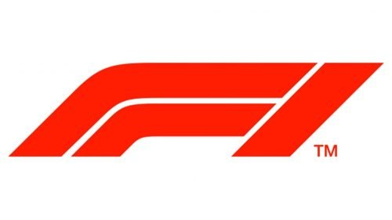
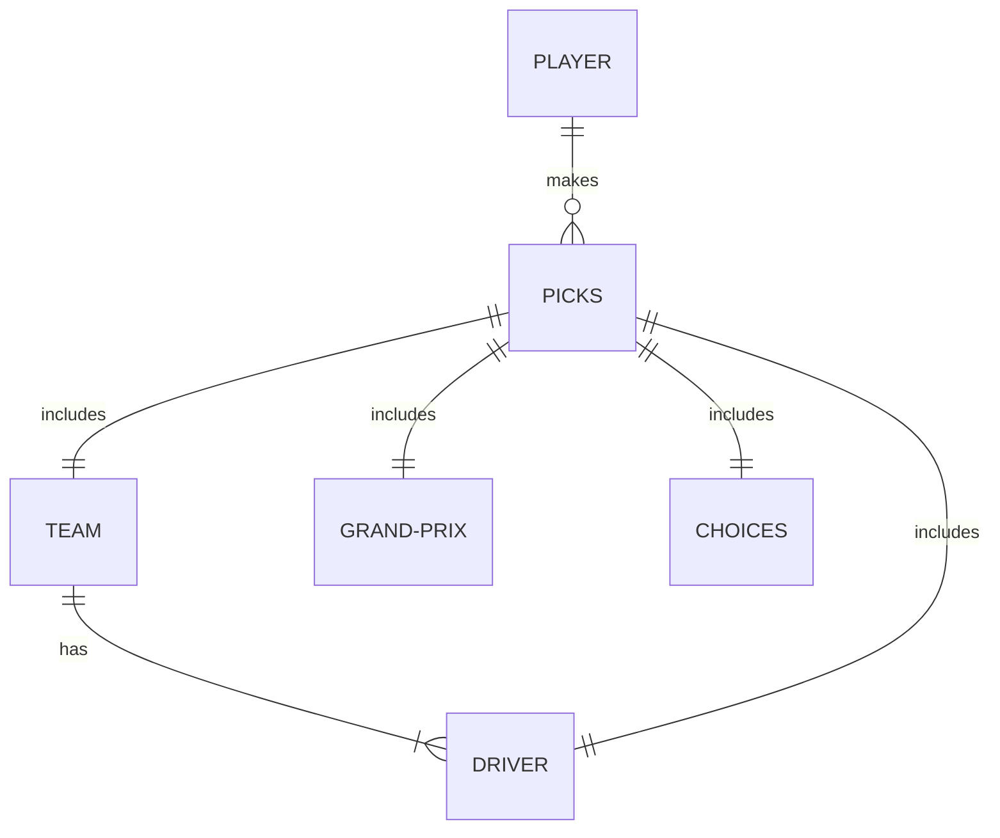
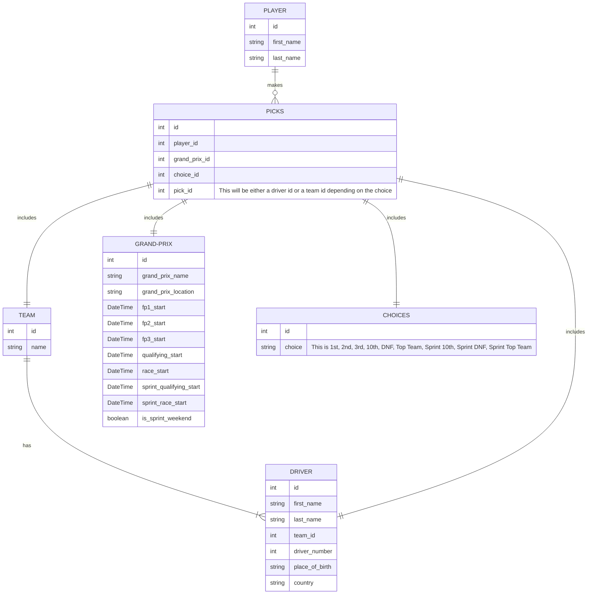

# F1 Fantasy League

## Introduction

This is an F1 Fantasy League app. It is solely being built as part of a training project.

## Purpose

The purpose of the F1 Fantasy League app (codename: _Drift Kings_) is to provide a space for friends to get together and guess how the drivers will do on any given week during the F1 season.

## Features

### Must Have

- A person must be able to sign in.
- A person must be able to make picks.
- An admin must be able to add and remove race/sprint/driver/team/race result info in the database.
- A person must be able to see how they did in each Grand Prix weekend.
- A person should be able to see a leaderboard that shows the current updated standings of everyone participating.

### Should Have

- A person should not be able to enter picks once qualifying starts.
- A person should have a way to know when the picks they have made will lock.
- A person should be able to see their own profile and the profiles of others.

### Could Have

- The app could have a pseudo-calendar showing when and where each Grand Prix (and it's associated events) will take place. This could be as simple as a list.
- The app could have an admin section where the admin could perform the tasks necessary to maintain the app. Add/delete players, add/delete race/sprint/driver/team/race result info, etc.
- The app could include driver/team logos/avatars.

### Won't Have / Wish List

- Driver/team/grand prix profile pages each with info about the driver, team, or grand prix.
- Fantasy league history page with results for each year. Who participated, final league standings, etc.

## Entity Relationship Diagrams

<small>The F1 Fantasy League app is an independent project and is not affiliated with, endorsed by, or in any way connected to Formula 1, the FIA, or any of their affiliates. The contents and functionalities of this app are solely the responsibility of its creators, and any opinions expressed do not reflect those of Formula 1 or the FIA.</small>
